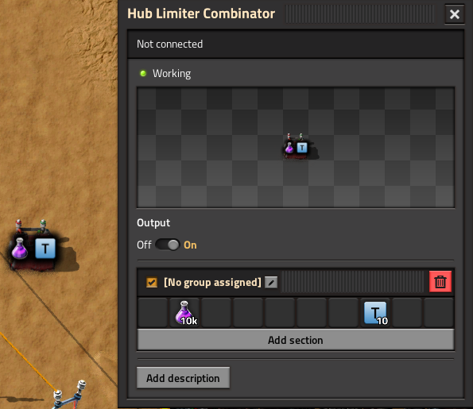
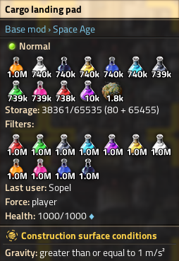
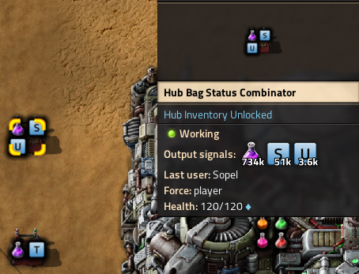

# Hub Inventory Unlocked

Attach a script-managed "bag" to a hub to be able to utilize all available slots - past the in-game limitation of 65535 slots.

Place a Hub Limiter Combinator anywhere on a surface. It will be connected automatically with the hub on the same surface. Set combinator values to indicate how many items should be kept inside the hub's inventory. Items that are not set in the combinator will not be moved to the bag. Use the T signal to specify update period in ticks (default: 60).

Additionally, you can use Hub Bag Status Combinator to read the bag's content and other properties. The U signal indicates the number of used slots in the bag. The S signal indicates the total number of slots in the bag.

## Edge cases and limitations

If enough cargo bays are removed, leaving the number of slots in the bag smaller than the number of slots used, the bag will not take new items and will attempt to place as many items back into the hub, disregarding the thresholds set by the combinator. No items will spill on the ground.

If either the hub or the bag is full then different items may not be moved equally.

Items with durability/health/ammo are handled as normal items, that is with an assumption that they are not partial. This may in some cases lead to slight positive deviation in the amount of owned items.

Spoilable items cannot be handled by this mod, setting the threshold for them will have no effect.

Items other than normal, module, tools, or ammo, cannot be handled either.

Base cargo bays are assumed to add 20 slots. Will not work with modded cargo bays. It is very cumbersome to retrieve the cargo bay's inventory bonus because there is no runtime API for it. Patches are welcome.

The bag persists even if the hub is removed.

The Hub Limiter Combinator must exist for the bag to work.

Will not work with mods that allow multiple hubs per surface. Will break badly. You've been warned.

You need to be careful with logistic/planetary requests as they won't take into account the items in the bag.